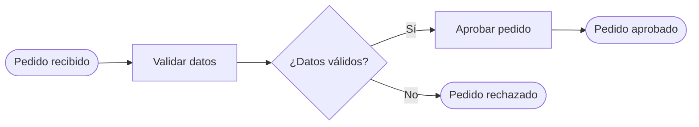

# Andamiaje XML draw.io (mxGraph) + Mermaid

## Estructura mínima de un .drawio

Un archivo draw.io es XML con raíz `<mxGraphModel>`. Los IDs `0` (raíz) y `1`
(capa default) son obligatorios. Cada figura es un `<mxCell vertex="1">`; cada
flecha un `<mxCell edge="1">` con `source` y `target`.

```xml
<mxfile host="app.diagrams.net">
  <diagram name="Proceso" id="proc1">
    <mxGraphModel dx="800" dy="600" grid="1" gridSize="20" guides="1"
                  tooltips="1" connect="1" arrows="1" fold="1" page="1"
                  pageScale="1" pageWidth="1169" pageHeight="826" math="0">
      <root>
        <mxCell id="0" />
        <mxCell id="1" parent="0" />
        <!-- nodos y aristas aquí -->
      </root>
    </mxGraphModel>
  </diagram>
</mxfile>
```

## Reglas de coordenadas (layout impecable)

- **Grilla 20px**, todo snapeado a múltiplos de 20.
- **Tarea**: 120×60. **Evento/Gateway**: 50×50 (offset Y +5 para centrar con
  tareas).
- **Pitch de columna**: 160px (x = 40, 200, 360, 520…).
- **Gutter vertical**: 40px entre nodos del mismo carril.
- Coordenadas de hijos de un lane son **relativas** al lane (parent).

## Plantilla de nodo y arista

```xml
<!-- Nodo -->
<mxCell id="n_inicio" value="Pedido recibido"
        style="ellipse;whiteSpace=wrap;html=1;fillColor=#d5e8d4;strokeColor=#82b366;"
        vertex="1" parent="1">
  <mxGeometry x="40" y="125" width="50" height="50" as="geometry" />
</mxCell>

<!-- Arista con etiqueta de rama -->
<mxCell id="e1" value="Sí"
        style="edgeStyle=orthogonalEdgeStyle;rounded=0;html=1;endArrow=block;"
        edge="1" parent="1" source="g_stock" target="t_reservar">
  <mxGeometry relative="1" as="geometry" />
</mxCell>
```

## Pools y lanes (handoffs)

```xml
<mxCell id="pool" value="Fulfillment"
        style="swimlane;html=1;horizontal=0;startSize=23;fillColor=none;"
        vertex="1" parent="1">
  <mxGeometry x="40" y="40" width="900" height="320" as="geometry" />
</mxCell>
<mxCell id="lane_ventas" value="Ventas"
        style="swimlane;html=1;horizontal=0;startSize=23;fillColor=none;"
        vertex="1" parent="pool">
  <mxGeometry x="23" y="0" width="877" height="160" as="geometry" />
</mxCell>
<!-- nodos del lane usan parent="lane_ventas" y coords relativas -->
```

## Leyenda (siempre incluir)

Un grupo en una esquina con una muestra de cada tipo usado:
```xml
<mxCell id="leg" value="Leyenda" style="rounded=1;dashed=1;html=1;fillColor=none;strokeColor=#999999;verticalAlign=top;"
        vertex="1" parent="1">
  <mxGeometry x="40" y="400" width="240" height="160" as="geometry" />
</mxCell>
<!-- + una muestra por color/forma usada, con parent="leg" -->
```

## Ejemplo completo (patrón Guarda previa + Aprobación)

```xml
<mxfile host="app.diagrams.net">
  <diagram name="Aprobacion pedido" id="proc1">
    <mxGraphModel dx="800" dy="600" grid="1" gridSize="20" page="1"
                  pageWidth="1169" pageHeight="826">
      <root>
        <mxCell id="0" />
        <mxCell id="1" parent="0" />

        <mxCell id="start" value="Pedido recibido" style="ellipse;whiteSpace=wrap;html=1;fillColor=#d5e8d4;strokeColor=#82b366;" vertex="1" parent="1">
          <mxGeometry x="40" y="125" width="50" height="50" as="geometry" /></mxCell>

        <mxCell id="t1" value="Validar datos" style="rounded=1;whiteSpace=wrap;html=1;fillColor=#dae8fc;strokeColor=#6c8ebf;" vertex="1" parent="1">
          <mxGeometry x="160" y="120" width="120" height="60" as="geometry" /></mxCell>

        <mxCell id="g1" value="¿Datos válidos?" style="rhombus;whiteSpace=wrap;html=1;fillColor=#fff2cc;strokeColor=#d6b656;" vertex="1" parent="1">
          <mxGeometry x="360" y="125" width="50" height="50" as="geometry" /></mxCell>

        <mxCell id="t2" value="Aprobar pedido" style="rounded=1;whiteSpace=wrap;html=1;fillColor=#dae8fc;strokeColor=#6c8ebf;" vertex="1" parent="1">
          <mxGeometry x="480" y="120" width="120" height="60" as="geometry" /></mxCell>

        <mxCell id="endok" value="Pedido aprobado" style="ellipse;whiteSpace=wrap;html=1;fillColor=#f8cecc;strokeColor=#b85450;strokeWidth=3;" vertex="1" parent="1">
          <mxGeometry x="680" y="125" width="50" height="50" as="geometry" /></mxCell>

        <mxCell id="endrej" value="Pedido rechazado" style="ellipse;whiteSpace=wrap;html=1;fillColor=#f8cecc;strokeColor=#b85450;strokeWidth=3;" vertex="1" parent="1">
          <mxGeometry x="360" y="260" width="50" height="50" as="geometry" /></mxCell>

        <mxCell id="e0" style="edgeStyle=orthogonalEdgeStyle;html=1;endArrow=block;" edge="1" parent="1" source="start" target="t1"><mxGeometry relative="1" as="geometry"/></mxCell>
        <mxCell id="e1" style="edgeStyle=orthogonalEdgeStyle;html=1;endArrow=block;" edge="1" parent="1" source="t1" target="g1"><mxGeometry relative="1" as="geometry"/></mxCell>
        <mxCell id="e2" value="Sí" style="edgeStyle=orthogonalEdgeStyle;html=1;endArrow=block;" edge="1" parent="1" source="g1" target="t2"><mxGeometry relative="1" as="geometry"/></mxCell>
        <mxCell id="e3" value="No" style="edgeStyle=orthogonalEdgeStyle;html=1;endArrow=block;" edge="1" parent="1" source="g1" target="endrej"><mxGeometry relative="1" as="geometry"/></mxCell>
        <mxCell id="e4" style="edgeStyle=orthogonalEdgeStyle;html=1;endArrow=block;" edge="1" parent="1" source="t2" target="endok"><mxGeometry relative="1" as="geometry"/></mxCell>
      </root>
    </mxGraphModel>
  </diagram>
</mxfile>
```

## Equivalente en Mermaid (misma lógica)



### Mapeo BPMN → Mermaid
| BPMN | Mermaid flowchart |
|---|---|
| Evento (inicio/fin) | `id([texto])` |
| Tarea | `id[texto]` |
| Sub-proceso | `id[[texto]]` |
| Gateway | `id{¿pregunta?}` |
| Dato/Almacén | `id[(texto)]` (cilindro) |
| Flujo + etiqueta | `a -- etiqueta --> b` |
| Flujo mensaje | `a -. mensaje .-> b` |
| Lane | `subgraph Rol ... end` |
| Máquina de estados | usar `stateDiagram-v2` en vez de `flowchart` |

## Validación rápida del XML antes de entregar
- IDs `0` y `1` presentes; todo `parent` apunta a un id existente.
- Toda arista tiene `source` y `target` válidos (sin colgar).
- Coordenadas en múltiplos de 20; sin solapes de geometría.
- `gridSize="20"` y `grid="1"`.
